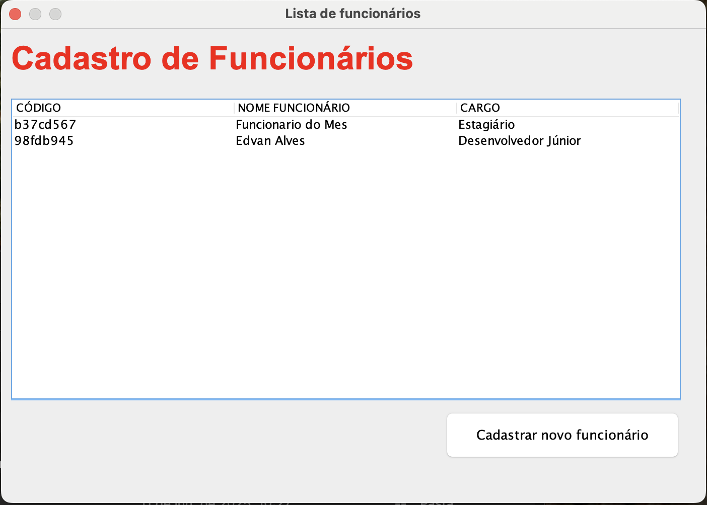
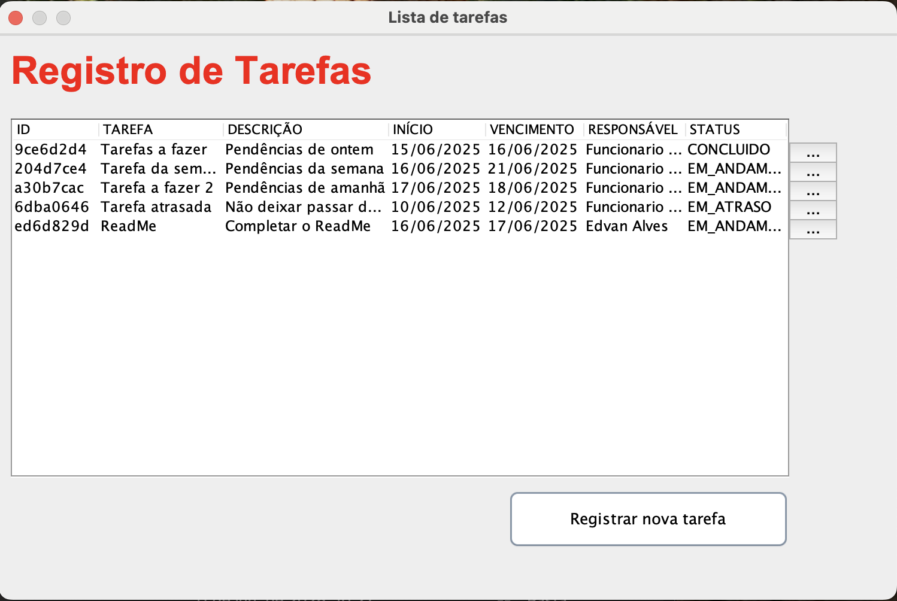
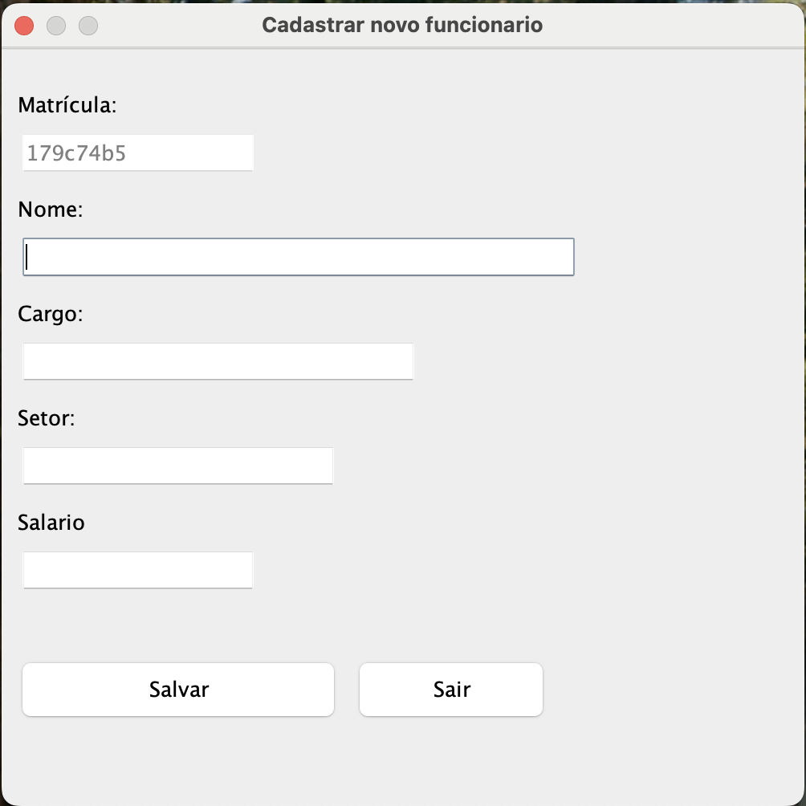
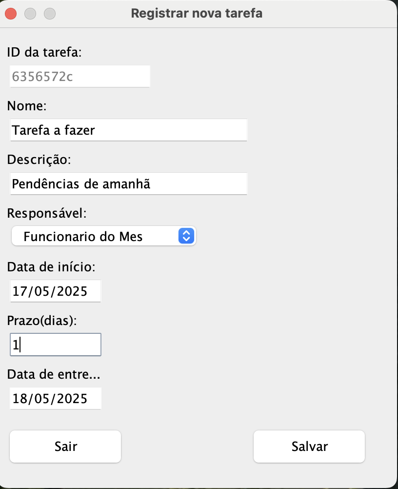
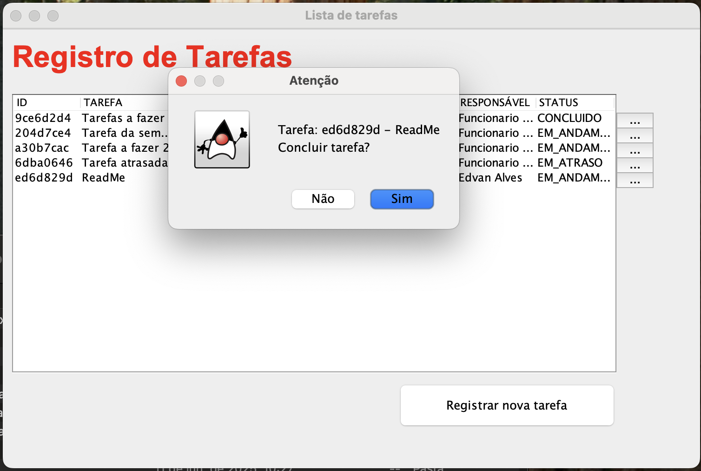

# Lopal_Gerenciador_Tarefas

Situação de Atividade Somativa para aplicação do conteúdo estudado no primeiro Semestre em Java,
Tendo como proposta criar um aplicativo para gerenciamento de funcionários e tarefas utilizando da programação orientada a objetos e biblioteca Swing para interface gráfica.

# Telas

## Listas

### Lista de funcionários

### Lista de tarefas

O status é um campo que se atualiza automaticamente de acordo com a data ou com input do usuário (Para concluir a tarefa)

## Formularios

### Cadastro de funcionários

### Atribuição de tarefas 

Data de entrega é calculado automaticamente utilizando da data de início e a data de prazo

### Conclusão de tarefas

Funcionalidade para concluir as tarefas

## Tecnologias utilizadas:

* Java

## Autor
[Edvan Alves](<https://br.linkedin.com/in/edvan-alves>)